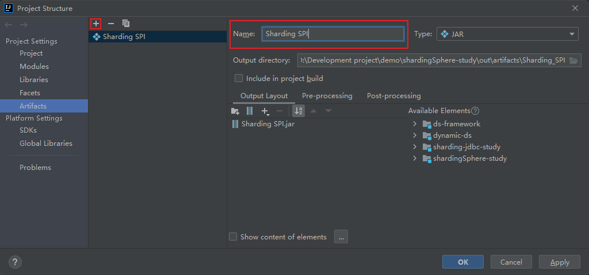
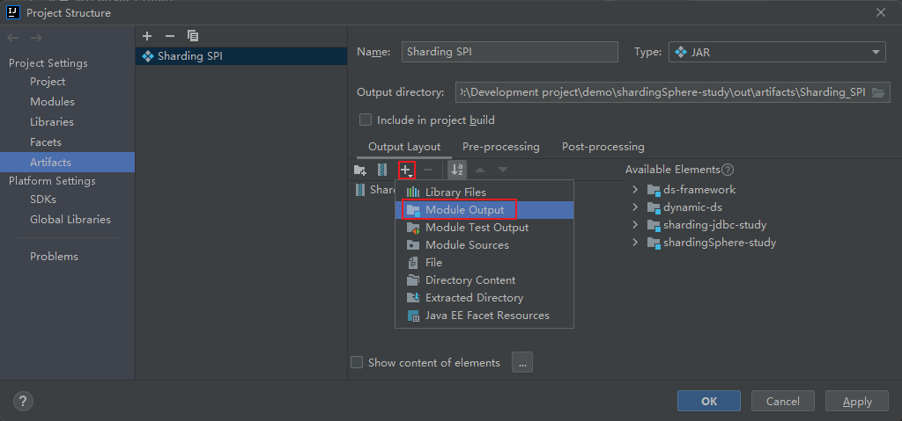
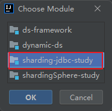
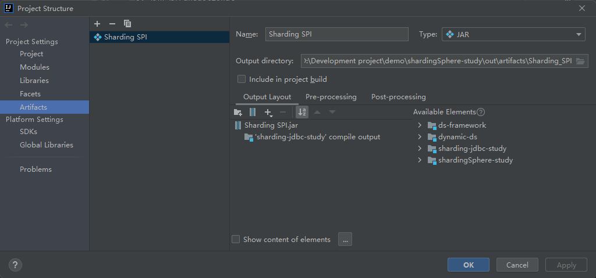
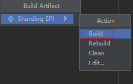

实现动态切换数据源
ds-framework：对每个 SQL 提前配置好，属于哪个数据源
dynamic-ds：通过前端传过来的参数，判断选择哪个数据源

sharding-jdbc-study  通过 ShardingJDBC 实现分库分表

### 主键生成策略
可查看 19-ShardingProxy分库分表实战及同类产品选型对比： 1:23.00 观看视频介绍
利用 SPI 机制, resources--->META-INF.services--->org.apache.shardingsphere.spi.keygen.ShardingKeyGenerator
- 如何打包成jar包，放入sharding proxy中使用？
  1. 打开 File--->Project Structure
  2. 点击 Artifacts, 添加 
  3. 
  4. 
  5. 
  6. 打开 Build--->Build Artifacts
  7. 
  8. 将打好的包，复制于 sharding proxy的 lib包下

### Sharding JDBC 使用 Base 柔性事务
1. 启动 nacos 与 seata (包括将seata配置上传至 nacos)
2. 在classpath 下 添加 registry.cof、seat.conf 两个配置
3. 使用 @Transactional

注意！！！：
1. ShardingJDBC 与 Sharding Proxy依赖任选其一使用
2. 测试分布式事务时，在业务层测试，不要在 Test类中测试
